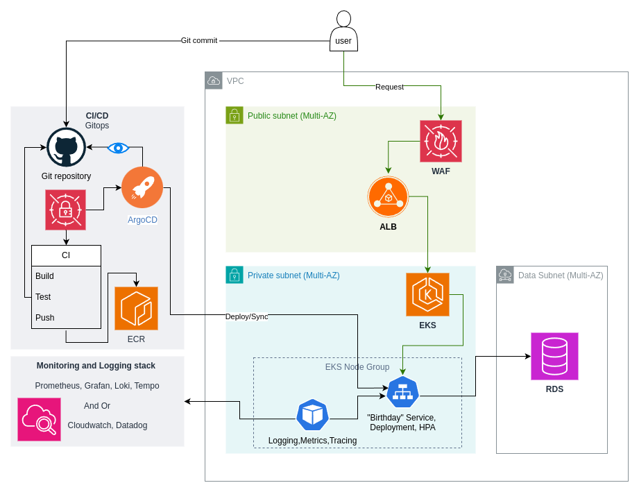

# AWS deployment

## Architecture diagram

## 1. Set up the underlying infrastructure
- Using IaC, [Terraform](https://developer.hashicorp.com/terraform) to create AWS resources (EKS, VPC, RDS, ALB, etc...)
- Changes to the terraform configuration would update the underlying infrastructure in the CI/CD pipeline ([Atlantis](https://www.runatlantis.io/) cold be a good choice for that) 

## 2. Store the desired state in Git
- The Git repository contains all Kubernetes manifests or helm chart.
- The manifests are the single source of truth, any change to the application (image version, replica count, environment variables) is made by committing a change to this repo.

## 3 Install Argo CD on the EKS cluster
- Argo CD watches the Git repository.
- An Application resource points to the repo URL, branch, and the folder where the manifests are.
- Argo CD continuously compares the live cluster state with the Git‑defined state.

## 5. Secrets handling

- For security, the secrets are managed by an external secret store (AWS Secrets Manager) that Argo CD can inject at sync time.

## 4. Continuous delivery workflow
- Code change → CI builds a new Docker image and after every test succeeded pushes it to ECR.
- CI updates the image tag in the Deployment manifest and commits the change to Git.
- Argo CD detects the new commit, syncs the manifests, and applies them to the EKS cluster.
- If someone manually edits a resource in the cluster, Argo CD will automatically revert it to match Git (self‑heal).

# Local developemnt environment
- Using docker compose and make file for easy access
- Local kind cluster with ArgoCD can be used for testing as well, `make db-up-kind` makes the database available for the local Kubernetes cluster
